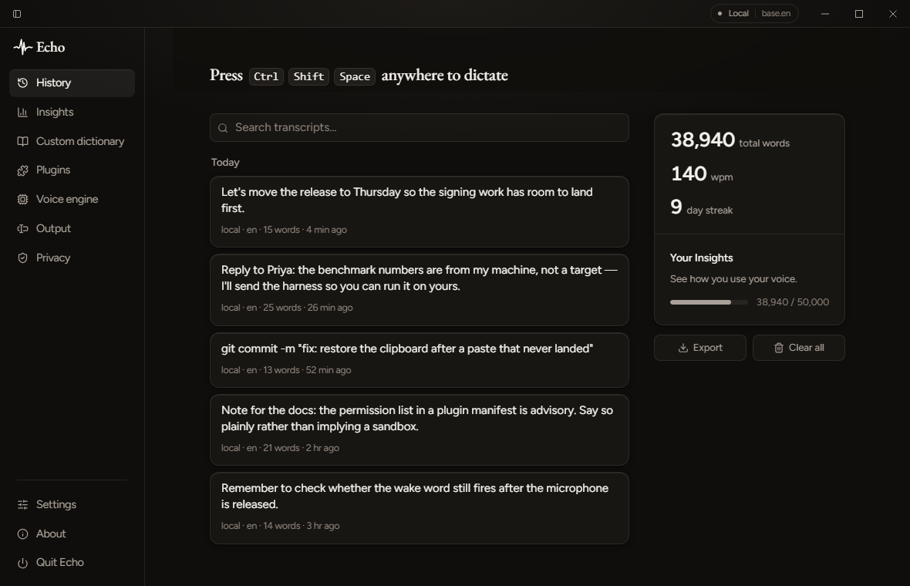

# Echo — Universal Voice Keyboard

Echo is a privacy-first, cross-platform **voice keyboard**: press a hotkey, speak,
and Echo transcribes your speech and types it into whatever app is focused.
Transcription runs **locally** (Whisper) or via **cloud providers** — OpenAI,
Groq, Deepgram, Mistral, ElevenLabs, AssemblyAI, Speechmatics, Azure, Google, or
any OpenAI-compatible endpoint you host yourself. Your choice, your keys.

Built with **Rust · Tauri v2 · React 19 · TypeScript · TailwindCSS v4 · SQLite**.



*What Echo keeps after you dictate — with sample transcripts, and the offline
engine running (`Local · base.en`, top right). You dictate from a small
always-on-top pill rather than from this window, which is why it is not in
shot.*

**Using Echo** — [Features](#features) · [Installing](#installing) · [Transcription backends](#transcription-backends) · [Text injection](#text-injection-per-os) · [Per-app profiles](#per-app-profiles) · [What Echo sends](#what-echo-sends-and-where) · [Global hotkey](#global-hotkey) · [Tray & login](#tray-icon-and-starting-at-login) · [Privacy](#privacy) · [Troubleshooting](#debugging--troubleshooting)

**Building Echo** — [CONTRIBUTING.md](CONTRIBUTING.md) covers the repository layout, dev setup, architecture and release builds · [More docs](#docs)

---

## Features

**Speak anywhere.** A global hotkey starts recording — or a wake word, or simply
talking, if you turn those on. The transcript is typed or pasted into whatever
app has focus. Both the undo and the retry-on-a-stronger-model are global too,
because by the time you notice a mistake the focus has moved on.

**Offline by default.** Whisper runs on your machine and the audio never leaves
it.

**Or ten cloud providers, on your own keys.** OpenAI, Groq, Deepgram, Mistral,
ElevenLabs, AssemblyAI, Speechmatics, Azure and Google, plus any
OpenAI-compatible endpoint you host yourself. Pick the model per provider, test
a key before you trust it, and fall back to offline if a request fails — never
the other way round.

**Text that reads like writing.** Drops "um" and stuttered words, writes
numbers, times and units as digits, and takes spoken punctuation ("comma", "new
paragraph") in seven languages. Every one of them optional.

**A dictionary that biases the decoder,** rather than a find-and-replace
afterwards — your corrections steer Whisper offline *and* the provider in the
cloud. Enable entries individually, import and export as JSON.

**Per-app profiles** override insert behaviour and dictionary scope for a given
application, so a terminal can take the words exactly as spoken.

**Never types into a password field.** Windows and macOS ask the accessibility
API; Linux asks AT-SPI, which answers for fewer apps. Settings says how much of
your desktop is actually covered rather than pretending.

**You can see what left.** A log of every outbound request Echo made, telemetry
that is local-only and opt-in, and API keys held in the OS keychain.

**History and Insights.** Searchable transcripts, exportable to JSON; speaking
speed, the fixes Echo made, which apps you dictate into and an on-device-vs-cloud
split — all counted from your own history and never sent anywhere.

**Scriptable.** `echo --transcribe recording.mp3` prints to stdout, and
`echo --benchmark` measures your machine instead of promising numbers.

**Also in the box:** transcribe a wav/mp3/ogg/flac you already have, live text
as you speak (opt-in, per app), command mode that rewrites a selection through a
local LLM, a tray icon, start at login, signed auto-update, language pinning or
auto-detect, and an experimental plugin system.

---

## Installing

Download from [**Releases**](https://github.com/vedantnimbarte/Echo/releases), or:

**macOS / Linux**

```sh
curl -fsSL https://raw.githubusercontent.com/vedantnimbarte/Echo/main/scripts/install.sh | sh
```

**Windows** (PowerShell)

```powershell
irm https://raw.githubusercontent.com/vedantnimbarte/Echo/main/scripts/install.ps1 | iex
```

Both scripts fetch the latest release, verify it against the published
`SHA256SUMS.txt`, and install it. Pin a version with `ECHO_VERSION=v0.1.0` (sh)
or `-Version v0.1.0` (PowerShell). Read them first if you'd rather not pipe a
script into a shell — that's a reasonable instinct, and they're short.

### Echo is not code-signed yet

Signing certificates cost money Echo hasn't spent yet, so your OS will warn you.
This is expected, and here is exactly what you'll see:

| OS | What happens | What to do |
|---|---|---|
| **Windows** | SmartScreen: *"Windows protected your PC"* | **More info** → **Run anyway** |
| **macOS** | Gatekeeper refuses to open it, offering only *Move to Trash*, or says *"Echo is damaged and can't be opened"* | The install script clears the quarantine flag for you. Installing by hand: right-click Echo in Applications → **Open** → **Open**, or clear it yourself with `xattr -cr /Applications/Echo.app` |
| **Linux** | Nothing — no signing gate | — |

If that trade isn't one you want to make, [build from source](CONTRIBUTING.md)
instead: the result is identical and you compiled it yourself.

### The password-field guard is unverified on real hardware

Echo asks Windows UI Automation, or the macOS Accessibility API, whether the
focused control is masked, and refuses to type into it. That code compiles on
both platforms in CI but **has never been exercised against a real password
box**, so treat it as a seatbelt of unknown strength rather than a guarantee.

On Linux Echo listens on the AT-SPI accessibility bus for focus changes and
asks the focused control whether it is a password field. That is weaker in
ways Settings spells out for your machine:

- **No accessibility bus, no guard.** Minimal window managers and some Wayland
  sessions never start one; Echo then types everywhere, as before.
- **Accessibility off, GTK only.** Chromium, Electron, Firefox and Qt publish
  nothing unless the session's accessibility switch is on. Echo reads that
  switch but never flips it — it is desktop-wide, persists across logins, and
  costs every app memory and CPU. On GNOME you can opt in with
  `gsettings set org.gnome.desktop.interface toolkit-accessibility true` and
  then restart the browser.
- **Apps with no accessibility tree** (most terminals, games) send no focus
  events and are typed into as normal.

What has been run: under WSLg on Ubuntu 24.04, with session accessibility off,
a GTK 3 `GtkEntry` and a GTK 4 `GtkPasswordEntry` were reported as password
fields and their unmasked counterparts as ordinary ones, and with no session
bus the guard reported itself unavailable. That was the detection call, not a
full dictation into the app. Chromium, Electron, Firefox, Qt, and real GNOME,
KDE or wlroots desktops are unverified.

### Support tiers — what has actually been run

Echo's CI compiles and tests every platform, and the Rust suite plus a real
startup self-test run on Linux and macOS runners. That is not the same as
somebody dictating into twenty applications, so here is the honest state:

| Platform | Tier | What that means |
|---|---|---|
| **Windows x64** | Tested | Developed and used here. Text injection, the password-field guard, the tray, offline Whisper and the GPU pack have all been exercised by hand. |
| **macOS arm64** | Community | Compiles, unit-tests and self-tests in CI on a macOS runner, but has not been driven by hand. Accessibility and Automation permissions, and the password-field guard, are unverified against real applications. Bug reports welcome and expected. |
| **macOS x86_64** | Community (untested) | Built from the release after v0.4.0, cross-compiled on an Apple Silicon runner, and unit-tested in CI on an Intel runner. Nobody has run it by hand, and no tag has built it yet. It loads its own copy of ONNX Runtime 1.23.2, which needs macOS 13.4: on 12 to 13.3 Silero VAD falls back to the energy detector and the wake word is unavailable. See [docs/RELEASING.md](docs/RELEASING.md#how-the-intel-macos-build-gets-an-onnx-runtime). |
| **Linux X11** | Community | Needs `xdotool`. Password-field detection goes through AT-SPI: GTK apps only unless session accessibility is on, nothing without an accessibility bus, and unverified in browsers and Qt apps. |
| **Linux Wayland** | Degraded | Needs `ydotool` plus the `ydotoold` daemon, and some compositors refuse synthetic input outright. Per-app profiles do not work: no Wayland protocol reports which window is focused. |
| **Linux arm64** | Community | Built from the release after v0.4.0, and compiled and unit-tested in CI on an arm64 runner. Same requirements as x86_64 Linux above; nobody has run it by hand yet. |

If you use Echo on a Community-tier platform and it works, saying so is a
genuinely useful contribution — the gap is verification, not code.

### Per-OS requirements

What a user needs on each platform. This is the canonical list — later sections
link here rather than repeating it.

| OS | Install first | Permissions to grant |
|---|---|---|
| **Windows** | **WebView2 runtime** — preinstalled on Windows 11; on Windows 10 grab the *Evergreen* runtime from [Microsoft](https://developer.microsoft.com/microsoft-edge/webview2/). Typing into other apps needs nothing extra. | Microphone |
| **macOS** | Nothing. | **Microphone** and **Accessibility**. Without Accessibility, Echo can hear you but cannot type. |
| **Linux (X11)** | **`xdotool`**, for typing into other apps. The AppImage also needs FUSE — `sudo apt install libfuse2` on Debian/Ubuntu; a `.deb` and an `.rpm` are attached to each release too. The password-field guard needs the AT-SPI bus (`at-spi2-core`, standard on GNOME, KDE and most full desktops). | Microphone. For the password-field guard to cover browsers, Electron and Qt apps: session accessibility on (see [the guard](#the-password-field-guard-is-unverified-on-real-hardware)) |
| **Linux (Wayland)** | **`ydotool`** *and* a running **`ydotoold`** daemon. Some compositors refuse synthetic input whatever you install. The password-field guard needs `at-spi2-core`, as on X11. | Microphone. Session accessibility, as on X11 |

**Intel Macs** get their own `.dmg` from the release after v0.4.0, and the
install script picks it by architecture. Silero VAD and the wake word there
need macOS 13.4 or later; see the support tiers above.

**The tray icon** lands in the Windows notification area (possibly behind the
overflow arrow, where you can drag it out), the macOS menu bar, or whatever
status area your Linux desktop provides. A few minimal desktops have none at
all; Echo logs a warning and runs without it, still reachable through the pill
and the global hotkey.

### Updating

Echo checks for a new release on launch (switchable under About) and installs
it once you agree. Updates are signed, and an update that fails verification is
refused.

**Installed v0.4.0 or earlier?** Those builds shipped without the updater key, so
they cannot verify an update and never will. Re-run the install command above
once; every version after that updates itself.

---

## Building Echo yourself

Repository layout, per-OS dev setup, the architecture tour and how to build
installers all live in [CONTRIBUTING.md](CONTRIBUTING.md).

---

## Transcription backends

### Local Whisper (offline, default) — no build toolchain needed

The default local engine shells out to a bundled **`whisper-cli`** (whisper.cpp).
It needs **no** cmake/libclang at build time:

- **Windows** — the binary auto-downloads on first run (**Voice engine → Speech → Local models**, or the onboarding "Transcription" step).
- **macOS / Linux (dev)** — provide `whisper-cli` on your `PATH`
  (`brew install whisper-cpp`, or your distro's whisper.cpp package). Release
  installers bundle it, so end users need nothing.

Then in the app: **Voice engine → Speech → Local models** and download a model
(`tiny` / `base` / `small` / `medium`) and click **Use**. Models are saved under
the app data directory (see [Where things live](#where-things-live)).

> **Advanced — in-process Whisper.** An optional Cargo feature compiles
> whisper.cpp *into* the binary instead of shelling out. It needs `cmake` + LLVM
> `libclang` and is off by default:
> ```bash
> # Linux:   sudo apt install clang libclang-dev cmake
> # macOS:   brew install llvm
> # Windows: winget install LLVM.LLVM  &&  setx LIBCLANG_PATH "C:\Program Files\LLVM\bin"
> npm run tauri dev -- --features whisper
> ```

### Cloud providers (no native build needed)

In **Voice engine → Speech**, choose **A cloud provider**, then open the provider you
want. Paste a key and click **Save key** (it goes to your OS keychain), **Test
the key** to check it before you rely on it, and **Dictate with …** to send audio
there instead of to the offline engine.

| Provider | Get a key | Notes |
|---|---|---|
| **Groq** | [console.groq.com](https://console.groq.com/keys) | Usually the fastest. `whisper-large-v3-turbo` is cheaper still. |
| **OpenAI** | [platform.openai.com](https://platform.openai.com/api-keys) | `gpt-4o-mini-transcribe` beats `whisper-1` on both price and accuracy. 25 MB per request. |
| **Deepgram** | [console.deepgram.com](https://console.deepgram.com/) | The only one with **live streaming** — words appear as you speak. |
| **Mistral** | [console.mistral.ai](https://console.mistral.ai/api-keys) | Voxtral, around $0.18 per hour of audio. |
| **ElevenLabs** | [elevenlabs.io](https://elevenlabs.io/app/settings/api-keys) | Scribe; strong accuracy across 99 languages. |
| **AssemblyAI** | [assemblyai.com](https://www.assemblyai.com/app/account) | Uploads and queues — expect a few seconds even for a short phrase. |
| **Speechmatics** | [portal.speechmatics.com](https://portal.speechmatics.com/) | Strong multilingual. Also queues and polls. |
| **Azure AI Speech** | [portal.azure.com](https://portal.azure.com/) | Needs your resource **region** (e.g. `westeurope`) as well as a key. |
| **Google STT** | [console.cloud.google.com](https://console.cloud.google.com/apis/credentials) | Max 60 seconds. Google requires the key in the URL, so it can appear in proxy logs. |
| **Custom** | — | Any OpenAI-compatible endpoint — see below. |

Each provider has a **Model** field, pre-filled with a sensible default and
offering suggestions. It's free text, so a model released after your copy of Echo
still works — type its name.

Your **custom dictionary biases cloud transcription too**, not just the offline
engine, for the OpenAI-compatible providers.

If a cloud request fails — expired key, dropped wifi, rate limit — Echo retries
once, then falls back to the offline engine so you don't lose the dictation.
**Fallback only ever moves toward more privacy:** local never falls back to cloud,
however it fails.

#### Using a self-hosted or proxied endpoint

Pick **Custom (OpenAI-compatible)**, then fill in the endpoint and model. Anything
speaking OpenAI's `/audio/transcriptions` API works:

| What | Endpoint |
|---|---|
| [Speaches](https://github.com/speaches-ai/speaches) / faster-whisper | `http://localhost:8000/v1` |
| [LiteLLM](https://github.com/BerriAI/litellm) proxy | `http://localhost:4000/v1` |
| vLLM | `http://localhost:8000/v1` |
| OpenRouter | `https://openrouter.ai/api/v1` |
| Azure OpenAI | `https://<resource>.openai.azure.com/openai/deployments/<deployment>` |

A local endpoint keeps your audio on your own machine or network while still
skipping the native Whisper build. **Privacy → Request log** shows every host
Echo contacted, so you can confirm where the audio actually went.

---

## Text injection (per OS)

Echo types the transcript into the focused app. Two methods, selectable in
**Output → Insert → Method**:

- **Type keystrokes** (default) — universal, works everywhere.
- **Paste** — puts the text on the clipboard, sends the paste shortcut, then
  restores your clipboard. Faster and more reliable for long transcripts; note
  some apps (e.g. terminals) use a different paste shortcut.

What each OS needs before this works is in
[Per-OS requirements](#per-os-requirements). On macOS you can confirm the
permission took with **Output → Advanced → Check permission**.

---

## Per-app profiles

**Output → Apps** overrides how Echo behaves in a given app. Every
field can stay on **Global**, which inherits the setting above it — so a profile
can pin one behaviour (never auto-insert into a password manager) without
freezing the rest.

The app is identified by executable name on Windows, bundle id on macOS, and
X11 window class on Linux. *Detect* fills it in from whatever is focused.

Where the platform won't say which window is focused — **Wayland** (no protocol
exposes it), or **macOS without Automation permission** — profiles simply don't
apply and the global settings are used.

## What Echo sends, and where

**Privacy** shows whether the current configuration can reach the
network at all, plus a log of every outbound request Echo made: the host, why,
and when.

Read the claim precisely. This records **requests Echo itself made**. It is not
proof that nothing else left your machine — a process can't observe its own OS's
traffic, and a native plugin can make requests that never pass through the code
this instruments (see [PLUGINS.md](PLUGINS.md)).

## Global hotkey

Default is **`Ctrl/Cmd + Shift + Space`** to toggle recording. Change it in
**Settings → Dictation → Global hotkey** using Tauri accelerator syntax (e.g.
`CommandOrControl+Alt+E`). If the hotkey doesn't fire, another app may already
own that combination — pick a different one.

## Tray icon, and starting at login

Echo runs in the background, so it needs somewhere to live. The tray icon —
notification area on Windows, menu bar on macOS, status area on Linux — opens a
menu with **Settings…** and **Quit Echo**. That is the only persistent way back
in: the pill has no window chrome and stays out of the taskbar, and Settings
hides itself once onboarding is done.

A hotkey can only answer if Echo is already running, so **Settings → General →
Starting Echo** has *Start Echo when I log in*. The login item is registered
with your OS rather than recorded in `echo.db` — a registry `Run` key on
Windows, a LaunchAgent on macOS, an XDG autostart entry on Linux — and the
checkbox reads that back every time, so removing the entry with your own tools
switches the toggle off too. On a machine where policy forbids login items,
Settings shows the error it got rather than pretending it worked.

---

## Debugging & troubleshooting

### Where things live

Echo stores everything under its per-user **app data directory** (`com.echo.app`):

| OS | Path |
|---|---|
| **Windows** | `%APPDATA%\com.echo.app\` (`C:\Users\<you>\AppData\Roaming\com.echo.app`) |
| **macOS** | `~/Library/Application Support/com.echo.app/` |
| **Linux** | `~/.local/share/com.echo.app/` |

Inside it:

- `echo.db` — SQLite: settings, history, telemetry, dictionary.
- `models/` — downloaded Whisper models (`ggml-*.bin`).
- `wake/` — downloaded wake-word models (`*.onnx`), only if wake word is enabled.
- `bin/` — the downloaded `whisper-cli` (Windows).
- `plugins/` — installed plugins.

API keys are **not** here — they're in the OS keychain (Keychain on macOS,
Credential Manager on Windows, Secret Service on Linux).

### Logs

The Rust backend logs via `tracing` (the `echo` crate is at `debug` by default).

- **Dev (`npm run tauri dev`)** — logs print to the terminal you launched from.
- **Turn up verbosity** for other crates with `RUST_LOG`:
  ```bash
  RUST_LOG=echo=trace,tauri=debug npm run tauri dev     # macOS/Linux
  set RUST_LOG=echo=trace& npm run tauri dev            # Windows (cmd)
  ```
- **Frontend / WebView** — in a `tauri dev` build, right-click the window →
  *Inspect Element* to open the WebView devtools (console, network, React state).

### Common issues

| Symptom | Likely cause / fix |
|---|---|
| **App window is blank** | Vite dev server didn't start. Ensure `npm install` ran; check the terminal for the `localhost:1420` dev URL and for JS errors in the WebView devtools. |
| **No microphones listed / silent meter** | Grant OS microphone permission to the app (macOS: Privacy & Security → Microphone). Pick the correct device in Settings; test with the meter. |
| **Transcription does nothing (local)** | `whisper-cli` not found. Windows: download one under **Voice engine → Speech → Local models**. macOS/Linux dev: `brew install whisper-cpp` / ensure `whisper-cli` is on `PATH`. Also confirm a model is downloaded and selected. |
| **Cloud transcription fails** | Re-check the API key in Settings (stored in keychain), provider quota, and network. Bump `RUST_LOG` to see the request error. |
| **Text doesn't appear in other apps** | macOS: grant Accessibility. Linux: install `xdotool` (X11) or run `ydotoold` (Wayland). Try switching **Insert method** between Type and Paste. |
| **Paste inserts into the wrong app / not at all** | The focused app may use a non-standard paste shortcut, or focus changed during the insert delay. Switch to **Type keystrokes**, or raise **Insert delay (ms)**. |
| **Hotkey doesn't toggle recording** | Another app owns the shortcut. Change it in Settings → Dictation → Global hotkey. |
| **Can't find Echo / no way to quit** | Use the tray icon — on Windows it may be hidden behind the notification-area overflow arrow. If your Linux desktop has no status area, check `echo.log` for a tray warning; the global hotkey still works. |
| **Launch at login won't stick** | On a managed machine the login item can be blocked by policy — Settings reports the error it got. Echo reads the state back from the OS, so removing the entry with your own tools turns the toggle off, as it should. |
| **Model download stalls** | Network/proxy issue; delete the partial file in `models/` and retry. |
| **`libclang` / cmake errors at build** | Only the optional `--features whisper` path needs those — omit the feature to use the default `whisper-cli` engine. |

### Reset state

- **Re-run onboarding:** delete the `onboarding_complete` setting (or the whole
  `echo.db`) from the app data directory, then relaunch.
- **Full reset:** quit Echo and delete the app data directory above. API keys in
  the keychain are separate — remove those from your OS keychain tool if needed.

---

## Privacy

- Telemetry is **local only** and **opt-in/out** in Settings — events are stored
  in SQLite on your machine and never transmitted. You can view counts and delete
  all data.
- Recorded telemetry never includes audio, transcript text, file paths, or window
  titles — only counts and coarse metadata (e.g. word count).
- API keys live in the OS keychain and are never returned to the UI.
- Cloud transcription sends your audio to the provider you configured; local
  Whisper sends nothing.

---

## Docs

- [CONTRIBUTING.md](CONTRIBUTING.md) — dev setup & architecture
- [PLUGINS.md](PLUGINS.md) — plugin manifest & SDK contract
- [RELEASING.md](docs/RELEASING.md) — cutting releases & auto-update signing
- [BUNDLING.md](docs/BUNDLING.md) — staging the offline Whisper engine
- [WAKE_WORD.md](docs/WAKE_WORD.md) — wake word + command mode, and training a custom phrase

## License

TBD.
